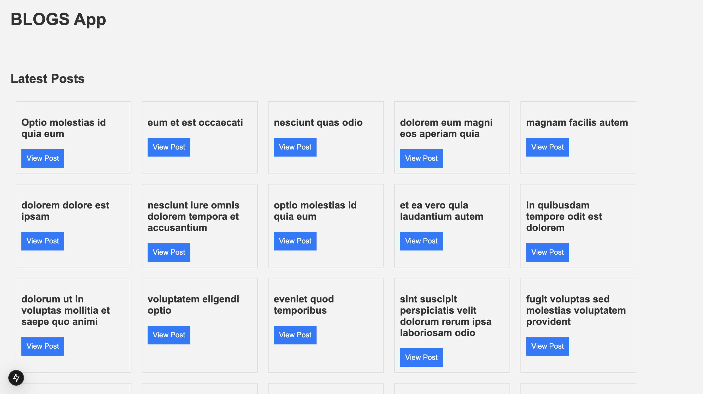
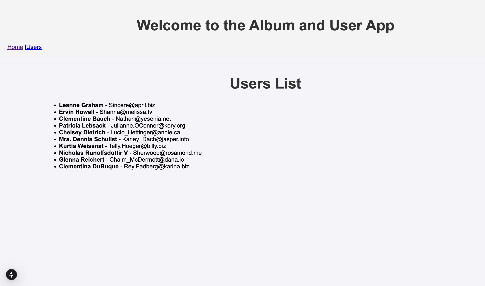
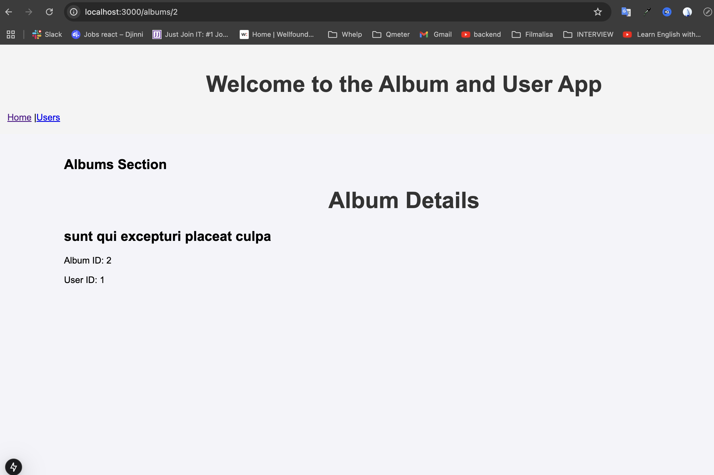

# Task 3 - To use a local image and url image, import your .jpg, .png, or .webp image files from your public folder.

## Objective:

- Create a Next.js app that fetches posts from a placeholder API using the App Router, and displays the data with server-side rendering. The app will use Next.js CSS Modules for styling.

### 📂 HOME

### 📂 USERS

### 📂 Album ID SSR

