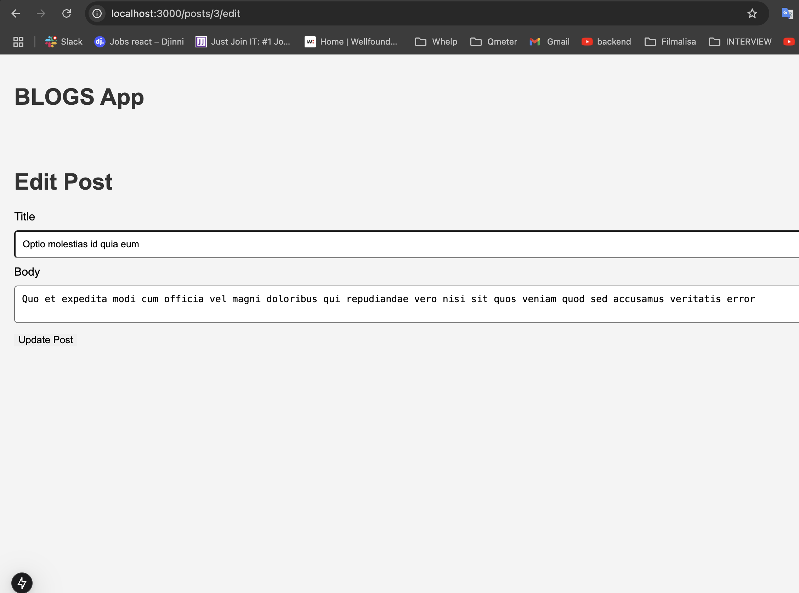

# Task 3 - Homework: Build a Blog App with Real API (CRUD)

## Objective:

- Fetches posts from the provided API (https://blog-api-t6u0.onrender.com/posts).
- Allows the user to create, view, update, and delete blog posts.

### 📂 HOME

### 📂 USERS

### 📂 Album ID SSR

