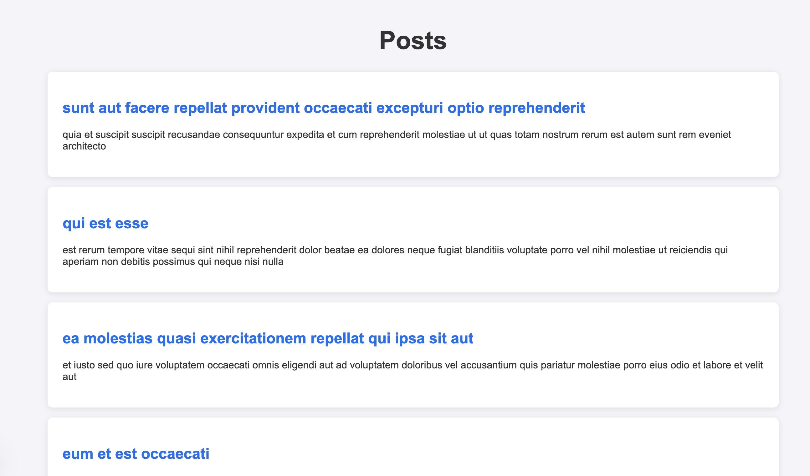

# Task 1 - Create a Next.js App with App Router, Styling, and Server Data Fetching

## Objective:

- Create a Next.js app that fetches and displays user data from an API using server components, styles with CSS modules, and optimizes images with next/image.

### 📂 SCREEN

### 📂 SCREEN 2 SRR RENDER

